# Dream Walker

## 1. 프로젝트 개요

Dream Walker는 짧은 1인칭 공포 게임이다.

이 게임은 내가 실제로 어렸을 때 꾸었던 꿈에서 아이디어를 얻었다.

어느 날 꿈속에서 엄마를 만났는데, 나는 그것이 꿈이라는 사실을 인지하고 있었다. 그래서 꿈속의 엄마에게 "이건 꿈이야."라고 말했는데, 그 순간 엄마의 표정이 바뀌면서 나를 미친 듯이 쫓아오기 시작했다.

나는 비명을 지르며 잠에서 깼고, 현실에서도 엄마가 놀라서 나에게 달려오고 있었다. 꿈속에서 보았던 장면과 현실의 장면이 겹쳐 보이면서 마치 꿈이 끝나지 않은 것 같은 느낌을 받았다.

가장 익숙하고 편안해야 할 존재가 갑자기 공포의 대상으로 변하는 경험이 굉장히 강하게 기억에 남았다. 그래서 이 경험을 직접 게임으로 만들어 보고 싶다는 생각이 들었고, Dream Walker를 기획하게 되었다.

---

## 2. 게임 진행 방식

### 2-1. 시작

게임은 침대에서 시작된다.

플레이어는 어두운 방 안에서 눈을 뜨고, 방 안에는 엄마 NPC가 서 있다.

플레이어는 WASD와 마우스를 이용하여 자유롭게 움직이고 시점을 변화시킬 수 있다.

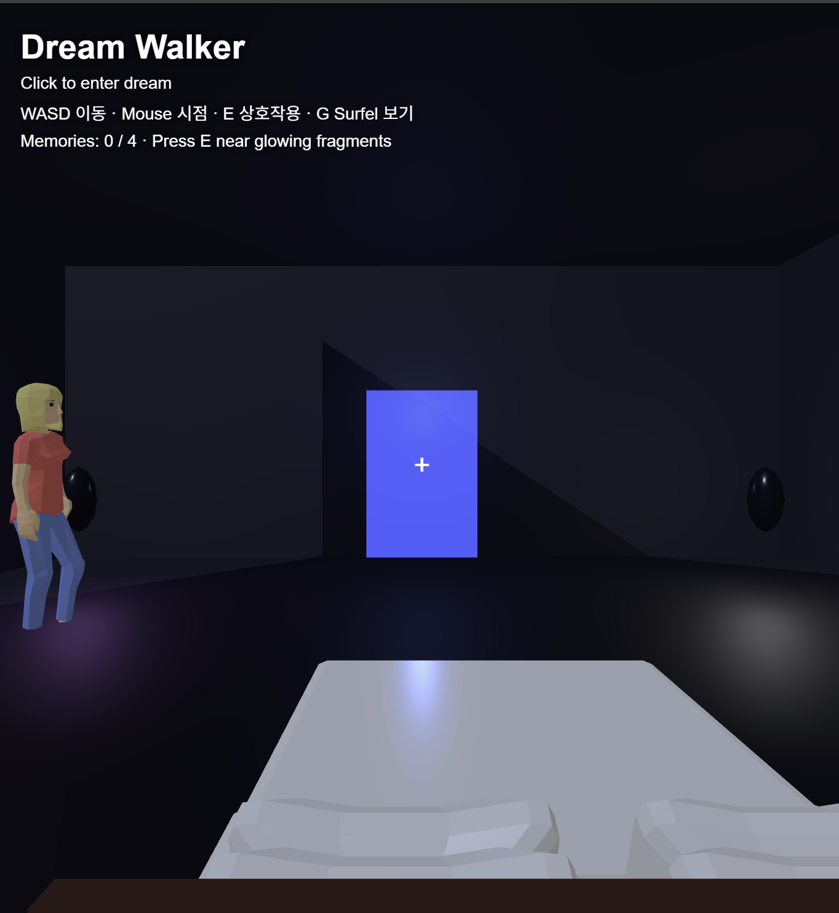

---

### 2-2. 엄마와의 대화

엄마에게 가까이 다가가 E 키를 누르면 대화를 할 수 있다.

엄마는 "일어났니? 학교 가야지."라고 말하며 두 개의 선택지를 제시한다.

* [1] 이건 꿈이다
* [2] 현실이다

이 상황에 이상함을 느끼면 [1]을 누르고, 현실이라고 판단하면 [2]를 누르면 된다.

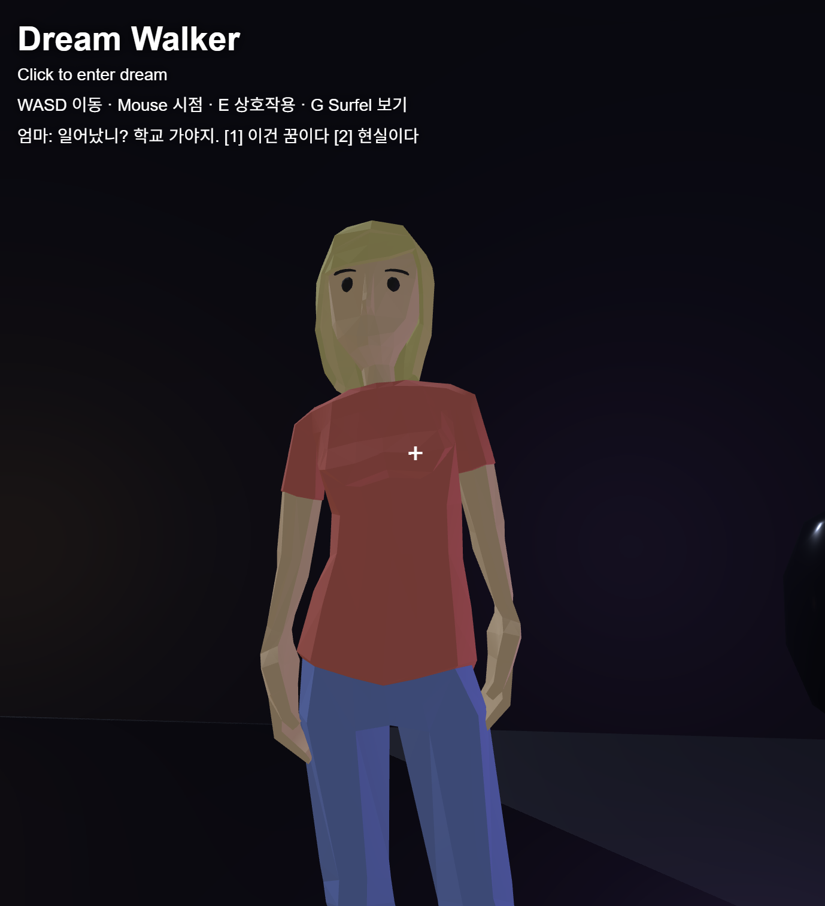

---

### 2-3. 악몽의 시작

플레이어가 "이건 꿈이다"를 선택하면 게임이 본격적으로 시작된다.

방 전체가 붉은색으로 물들고 조명이 변경된다.

엄마는 더 이상 평범한 모습이 아니라 플레이어를 따라다니며 꿈에서 깨지 못하도록 위협하는 존재로 바뀐다.

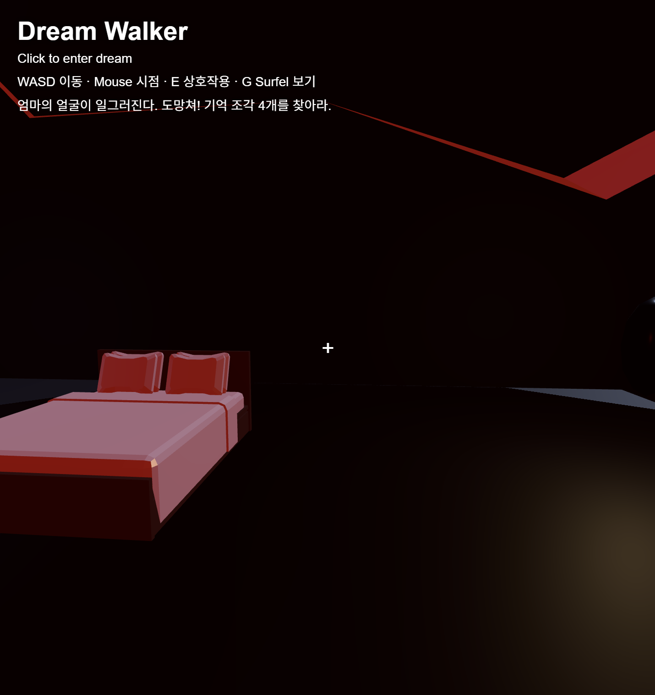

---

### 2-4. 기억 조각 수집

플레이어는 엄마를 피해 다니며 방 안에 흩어져 있는 기억 조각 4개를 찾아야 한다.

기억 조각은 검은 오브젝트 형태로 설정했다. 

방의 각 꼭짓점에 위치하도록 설계했다.

플레이어가 가까이 다가간 뒤 E 키를 누르면 수집된다.

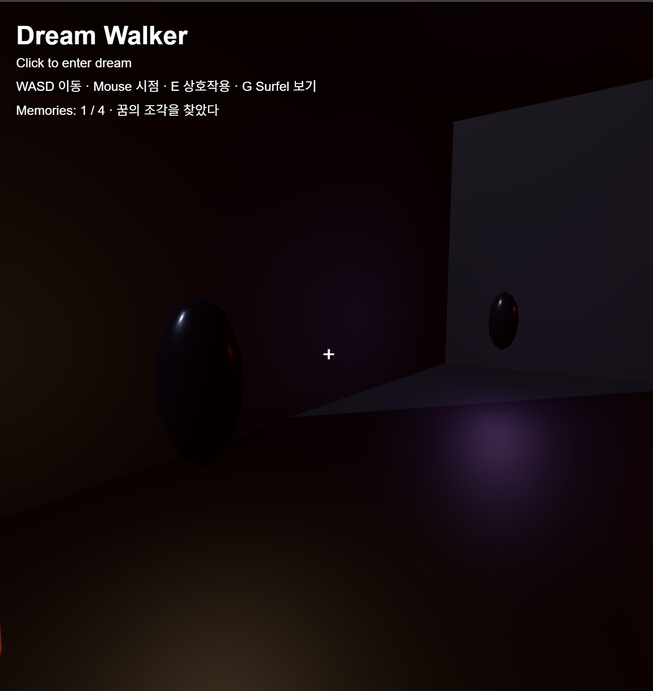

---

기억 조각을 수집하면 현재 수집 개수가 화면에 표시된다.

플레이어는 4개의 기억 조각을 모두 찾아야 한다.

기억 조각을 모두 수집해야 꿈에서 깰 수 있다.

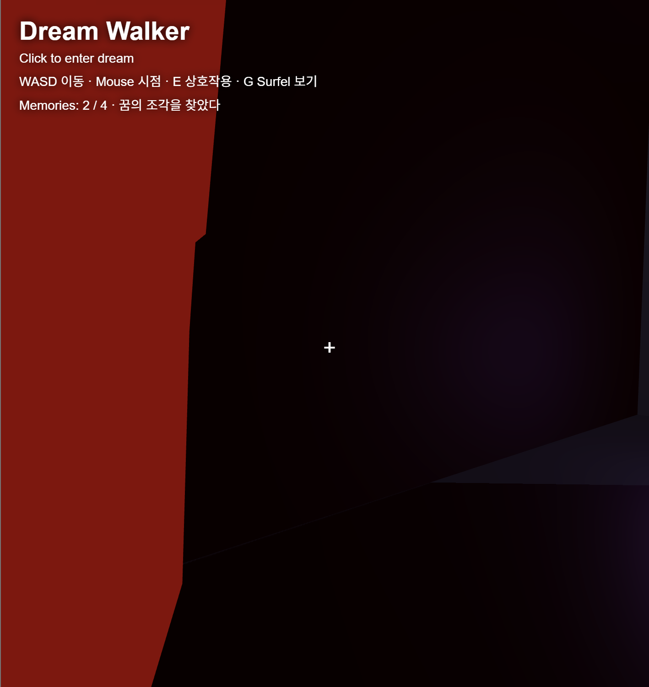

---

### 2-5. 꿈에서 깨어남

기억 조각을 모두 수집하면 화면이 하얗게 변한다.

방이 하얗게 변한 뒤 플레이어는 시작과 똑같이 침대에서 눈을 뜬다.

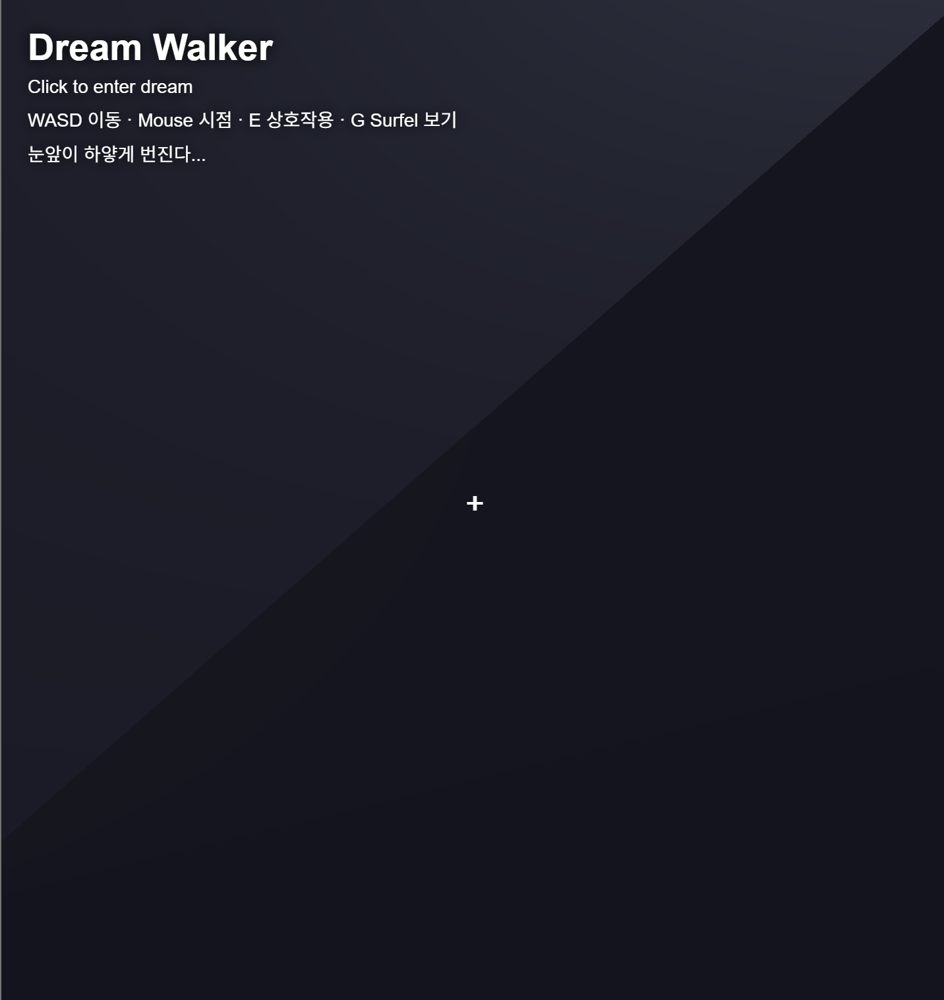

---

이후 방은 원래 상태로 복구된다.

붉은 조명과 공포 분위기가 사라지고 처음 게임을 시작했을 때의 공간으로 돌아온다.

두려움으로 얼른 엄마를 찾으면 엄마가 꿈에서와 똑같은 위치로 서있다.

'이것 또한 꿈인가' 라는 의문이 생기도록 엄마의 위치를 게임 시작과 같은 위치로 수미상관이다.

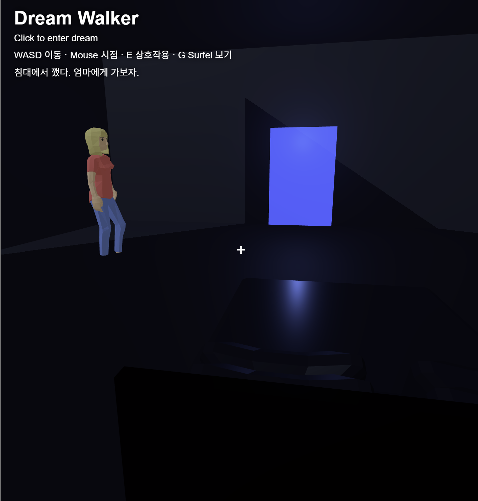

---

### 2-6. 마지막 장면

플레이어는 다시 엄마에게 다가간다.

엄마는 처음에 꿈에서 했던 말과 같은 대사를 친다. 

하지만 곧 플레이어에게 다시 가까이 다가오며 플레이어가 이 공포의 꿈이 아직 끝나지 않았음을 느낀다. 

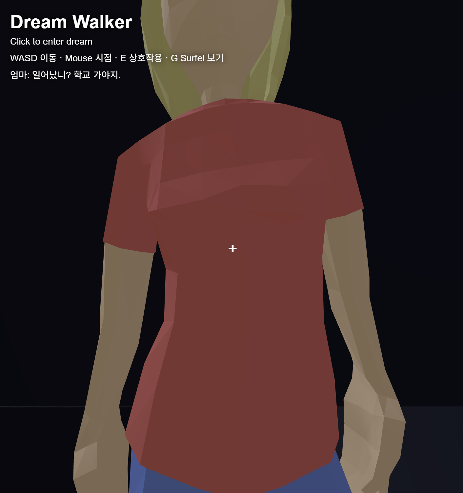

---

### 2-7. 엔딩

게임은 "깨어난 줄 알았다."라는 문장과 함께 종료된다.

꿈에서 깨어났다고 생각했지만 사실은 끝나지 않았다는 뜻이다.

이는 내가 진짜 피곤할 때 꿨던 꿈 중에서 분명 깼는데 그것 또한 꿈이었고 마지막에는 현실에서도 이게 꿈인지 의심했던 경험을 모티브로 삼았다. 

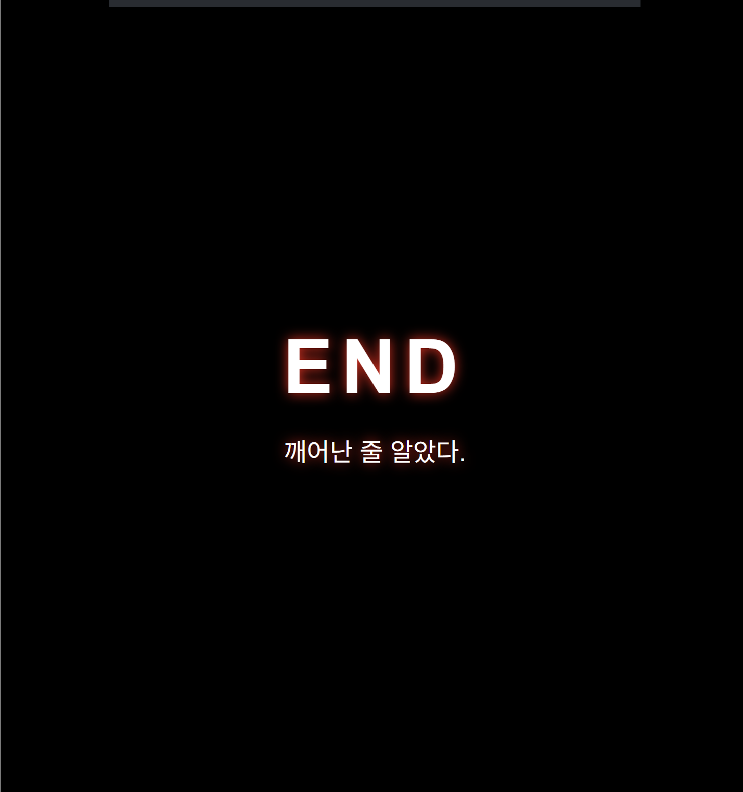

---

## 3. 구현 내용

### 3-1. First Person Camera

수업 시간에 배운 1인칭 카메라 방식을 사용하였다.

마우스를 움직여 시점을 회전할 수 있고, WASD 키를 이용해 직접 공간을 탐험할 수 있다.

공포 게임 특성상 플레이어가 직접 공간 안에 들어와 있는 느낌이 중요하다고 생각하여 1인칭 시점을 선택하였다.

3인칭 시점을 선택하지 않은 이유는 공포 게임 특성 상 주변시야의 한계가 있어야 더 무섭기 때문이다. 

위를 보고 있으면 갑자기 옆에서 다가오고, 오른쪽으로 보면 왼쪽에서 다가오는것이 더 무섭다고 판단했다.


---

### 3-2. Scene Graph

Three.js의 물체들의 부모-자식 관계를 나타낸 Scene 구조를 사용하여 침대, 벽, 문, 엄마 NPC, 기억 조각 등을 배치하였다.

빨간색이었던 방을 현실의 방으로 만들 때 물체들의 코드를 다 짜는 노가다를 하지 않아도 된다는 점에서 굉장히 유용했다.

프로젝트를 진행하면서 Scene Graph가 생각보다 중요하다는 것을 느꼈다.

이걸 다 같이 짜는 것도 힘들고 오류가 많이 뜨는데 이걸 하나하나 하는 것은 불가능에 가깝다고 느꼈기 때문이다.

특히 꿈에서 깨어나는 연출을 만들 때 Scene 내부 오브젝트들을 순회하며 색상과 조명 값을 원래 상태로 복구하는 과정에서 많이 사용하였다.

아래 사진은 동일한 물체 구조를 유지한채 꿈과 현실을 자연스럽게 전환할 수 있음을 보여준다.


---

### 3-3. Material

수업 시간에 Material이 물체의 외형을 결정한다는 내용을 배웠다. 

Three.js 에서 물체를 구성할 때 기하학적 구조와 재질이 필요한데 재질을 바꿈으로써 물체의 분위기가 달라질 수 있다고 배웠다.

이번 프로젝트에서는 같은 공간이라도 Material 색상을 바꾸어 전혀 다른 분위기를 만들 수 있었다.

평범한 방은 차가운 색을 사용하였고, 악몽 상태에서는 붉은 계열 색상으로 변경하였다. 또한, 여기서도 scene 구조가 굉장히 중요하다고 느꼈다.

Scene 구조를 몰랐다면 현실의 방과 악몽 방을 완전히 따로 2개로 만들어서 상황에 맞게 숨겼다 보였다 했어야 했는데 scene 구조를 통해 material의 색상 값만 바꿀 수 있었다.


사용 코드

```javascript
startRoom.traverse((obj) => {
  if (obj.isMesh && obj.material) {
    obj.material.color.set(0x660000);

    if (obj.material.emissive) {
      obj.material.emissive.set(0x330000);
      obj.material.emissiveIntensity = 1.5;
    }

    obj.material.needsUpdate = true;
  }
});
```

이 코드는 꿈이라고 선택한 뒤 방 안의 물체의 material 을 붉은색으로 바꾸는 부분이다.

처음에는 조명만 빨갛게 바꾸면 충분할 줄 알았는데, 벽과 바닥 색이 그대로라서 생각보다 분위기가 잘 변하지 않았다. 그래서 `material.color`와 `emissive` 값을 함께 바꾸어 방 전체가 무섭고 음침한 분위처럼 보이도록 수정하였다.

---

### 3-4. Lighting

처음에는 조명보다 Material 색상과 어두운 배경만 먼저 조정하였다.

이렇게 하니 무서운 분위기를 풍기는 것은 가능했다. 하지만, 공간 전체가 어딘가 납작하게 어두워 보였고 조명이 없는 듯해서 퀄리티가 떨어져 보였다. 실제와 같이 만들고 싶었기에 수정했다.

수정 이후 붉은 조명과 Point Light를 함께 사용하니 방 안의 특정 부분이 강조되고, 빛의 방향과 밝기 차이가 생겨 훨씬 입체적인 공포 분위기를 만들 수 있었다. 목표했던 실제와 유사한 공간을 만드는데 성공했다.

아래 사진은 수정 전과 수정 후의 방이다.


사용 코드

```javascript
const redLight = new THREE.PointLight(0xff0000, 6);
scene.add(redLight);
```

붉은 조명을 추가하여 공포 게임의 음침하고 무서운 분위기를 표현하였다.

처음에는 Material 색상만 변경했지만 공포 분위기가 충분하지 않았기 때문에 조명 색상도 함께 변경하였다.
---

### 3-5. Point Light

기억 조각 주변에는 Point Light를 배치하였다.

이것이 기억 조각이라는 것을 티냈어야 했는데 처음에는 그냥 검 물체가 덩그러니 있어서 게임 제작자인 나도 '이 요상한 건 뭐지...' 하고 지나칠 뻔 했다. 

아무 표시가 없으면 기억 조각을 찾기 어렵다고 판단했고 작은 빛이 퍼지도록 만들었다.

엄마가 쫓아오는데 내가 기억조각에 가까워지고 있는 건지 너무 헷갈렸다. 

근데 점 조명을 배치하니 내가 뭔가 다가가고 있구나가 느껴졌다.

점 조명은 실제로 거리감을 제공하는 역할도 수행한다고 한다.

기억 조각 주변에 점 조명을 배치하며 플레이어는 자연스럽게 빛을 따라 기억 조각을 발견할 수 있다.


---

### 3-6. Emissive Material

문과 일부 오브젝트에는 Emissive 값을 사용하였다.

처음에는 그냥 평범한 갈색으로 설정했는데 그렇게 하니 변화하는 조명에 너무 큰 영향을 받아서 문이 보이지 않는 경우가 생겼다.

문은 이것이 게임 플레이어의 방이라고 인식할 수 있는 중요한 요소였기에 포기할 수 없었다.

그래서 문이 스스로 빛을 낼 수 있도록 Emissive 값을 사용했다.

일반적인 색상만 사용하는 것보다 빛이 나는 것처럼 보이기 때문에 플레이어가 문이라는 것을 잘 인식할 수 있었다.

아래 사진은 문이 일반적인 색이라 잘 보이지 않는 경우이다.


---

### 3-7. Animation

엄마 NPC는 단순히 이동만 하는 것이 아니라 걸어오는 것처럼 보이도록 애니메이션을 적용하였다.

처음에는 엄마 NPC가 그냥 슬라이딩하는 것처럼 보였다. 그래서 뭔가 무섭기보다는 기괴한 느낌이 강했고 이는 내가 추구하는 공포 게임 분위기와는 맞지 않다고 판단했다.

그래서 몸이 위아래로 움직이도록 하여 정적인 움직임보다 자연스럽게 걷는 것처럼 표현하였다.

특히 추격 구간에서 엄마가 계속 플레이어를 향해 다가오도록 구현하여 긴장감을 높이고자 하였다.

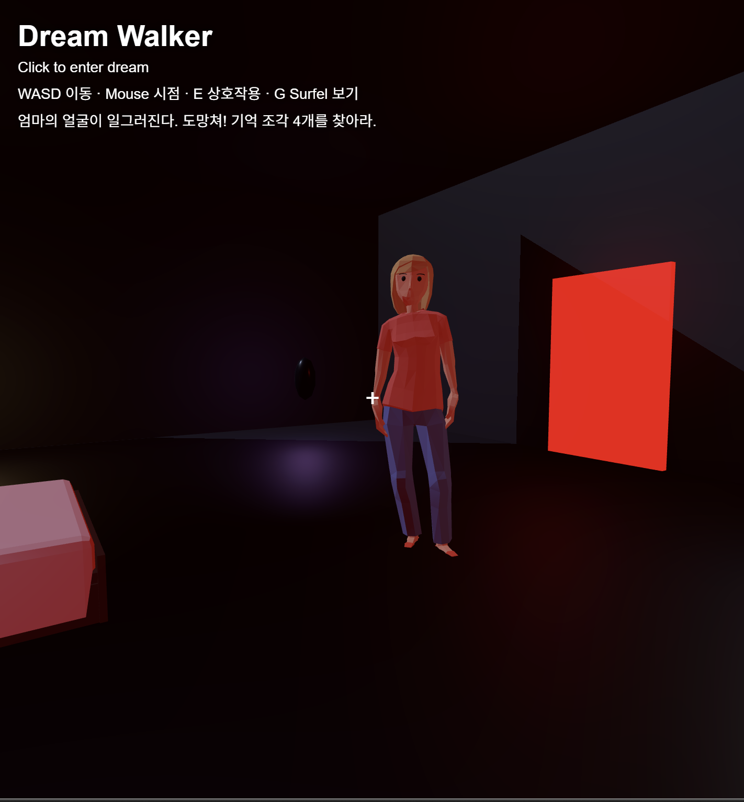

사용 코드

```javascript
momNPC.userData.walkPhase += 0.18;

momNPC.position.y =
Math.abs(Math.sin(momNPC.userData.walkPhase)) * 0.04;
```

NPC가 단순히 미끄러지듯 이동하는 것이 아니라 실제로 걸어오는 것처럼 보이도록 구현하였다.

사인 함수를 사용하여 몸이 위아래로 움직이도록 만들었다.
---

### 3-8. Collision 및 이동 제한

플레이어가 맵 밖으로 나가는 문제를 막기 위해 이동 범위를 제한하였다.

처음에 플레이를 했더니 캐릭터가 방 밖에 걸쳐있는게 가능했다. 즉, 맵 밖으로 나갈 수 있는 엄청난 문제가 발생했다. 

그래서 카메라 위치를 특정 범위 안으로 고정하여 의도하지 않은 공간으로 이동하지 못하도록 만들었다.

게임을 플레이하면서 벽을 뚫고 나가거나 이벤트 공간을 벗어나는 문제가 발생하지 않도록 구현하였다.

아래 사진은 벽을 뚫고 나간 모습이다.


```javascript
camera.position.x = Math.max(
  ROOM_MIN_X,
  Math.min(ROOM_MAX_X, camera.position.x)
);

camera.position.z = Math.max(
  ROOM_MIN_Z,
  Math.min(ROOM_MAX_Z, camera.position.z)
);
```
`Math.min()`과 `Math.max()`를 사용하여 플레이어가 벽 밖으로 이동하려고 하더라도 자동으로 허용 범위 안으로 되돌아오게 만들었다.
---

### 3-9. Interaction System

게임의 주요 이벤트는 모두 상호작용 시스템을 통해 진행된다.

엄마와의 대화, 기억 조각 수집 등이 모두 E 키 상호작용을 사용한다.

처음에는 가까이 가기만 해도 대화가 되고 기억 조각 수집이 가능하게 했다.

그랬더니 엄마한테 쫓기느라 바쁜 와중에 막 대화를 하고 엄마랑 대화를 해야하는데 기억조각이 수집돼서 정말 혼돈 그 자체였다. 

그래서 E키 상호작용을 사용했다.

덕분에 플레이어가 원하는 순간에 이벤트를 진행할 수 있게 되었다.


사용 코드

```javascript
document.addEventListener('keydown', (e) => {
  if (e.code === 'KeyE') {
    interact();
  }
});
```

```javascript
function interact() {
  if (!chaseStarted && !wakeUpStarted && currentStage === 'start'
      && momNPC
      && camera.position.distanceTo(momNPC.position) < 2.5) {

    statusText.textContent =
      '엄마: 일어났니? 학교 가야지.  [1] 이건 꿈이다  [2] 현실이다';

    waitingMomAnswer = true;
    return;
  }
}
```

이 코드는 플레이어가 E 키를 눌렀을 때 `interact()` 함수가 실행되도록 만든 부분이다.

그 안에서 플레이어와 엄마 NPC 사이의 거리를 확인하고, 충분히 가까울 때만 대화가 나오도록 하였다.

처음에는 가까이 가기만 해도 대화가 나오게 만들 수 있었지만, 그러면 플레이어가 의도하지 않았는데 이벤트가 시작될 수 있었다. 그래서 E 키를 눌렀을 때만 상호작용이 발생하도록 수정하였다.


---

### 3-10. Distance Check

엄마와 대화하거나 기억 조각을 획득할 때 거리 계산을 사용하였다.

플레이어가 충분히 가까이 왔을 때만 이벤트가 발생하도록 구현하였다.

실제 게임을 만들면서 거리 계산이 생각보다 자주 사용된다는 것을 알게 되었다.

특히 대화 시스템과 기억 조각 수집 시스템 모두 거리 계산을 기반으로 동작한다.


```javascript

if (

 camera.position.distanceTo(momNPC.position) < 2.5

) {

 statusText.textContent =

 '엄마: 일어났니? 학교 가야지.';

}

```
---

### 3-11. State 관리

게임은 여러 단계로 구성되어 있다.

1. 시작 상태
2. 꿈을 인지한 상태
3. 기억 조각 수집 상태
4. 꿈에서 깨어난 상태
5. 엔딩 상태

처음 코드를 짰을 때 꿈에서 깼는데 엄마가 계속 추격을 하고 꿈이라고 했는데 추격을 안하는 그런 혼란이 있었다. 때에 맞지 않는 코드가 계속 실행되는 문제들이 있었다.

그래서 현재 상태를 저장하는 변수를 만들어 각 단계별로 다른 이벤트가 실행되도록 수정하였다.

이 부분이 게임 전체 구조를 만드는 데 가장 중요한 역할을 하였다.


사용 코드

```javascript
let chaseStarted = false;
let wakeUpStarted = false;
let gameEnded = false;
let waitingMomAnswer = false;
```

```javascript
if (gameEnded) return;
```

```javascript
if (
  chaseStarted &&
  momNPC &&
  !wakeUpStarted &&
  !gameEnded
) {
  // 엄마 NPC 추격 실행
}
```

이 코드는 게임의 상태를 나누어 관리하기 위해 사용한 부분이다.

`chaseStarted`는 엄마의 추격이 시작되었는지, `wakeUpStarted`는 플레이어가 꿈에서 깨어난 상태인지, `gameEnded`는 엔딩이 끝났는지, `waitingMomAnswer`는 엄마와의 첫 대화에서 선택지를 기다리는 상태인지 확인하는 변수이다.

이렇게 상태를 나누지 않으면 꿈에서 깬 뒤에도 추격 코드가 계속 실행되거나, 엔딩 이후에도 상호작용이 다시 발생할 수 있다. 그래서 각 기능이 실행되기 전에 현재 상태를 먼저 확인하도록 만들었다.

또한 기억 조각을 모두 모았을 때만 꿈에서 깨어나는 함수가 실행되도록 하였다.

```javascript
if (memories >= 4) {
  triggerWakeUp();
}
```

기억 조각 4개를 다 모으면 잠에서 깰 수 있도록 만들어주는 함수이다. 

---

### 3-12. Surfel Global Illumination

수업 시간에 DDGI(Dynamic Diffuse Global Illumination)와 Surfel 기반 간접광 표현 기법에 대해 배웠다.

GI(Global Illumination)는 빛이 물체 표면에 반사된 뒤 다른 표면에도 영향을 주는 현상이다. 일반적인 Direct Lighting 보다 훨씬 현실적인 조명 표현이 가능하지만 계산량이 매우 크다는 특징이 있다.

이번 프로젝트에서는 현실적인 문제 때문에 실제 DDGI 수준의 간접광 계산을 구현하지는 못했다. 

하지만,강의에서 배운 Surfel(Surface Element) 개념을 3D 게임 내에서 어떻게 분포되어 있는지 시각적으로 확인할 수 있도록 구현하였다.

G 키를 누르면 Surfel Point Visualization이 활성화된다.

Surfel 은 컴퓨터가 복잡한 빛 튕김을 계산할 수 있도록 방 안의 물체 표면에 눈에 안 보이는 가상의 계산용 점을 촘촘히 박아둔 것이다.

파란색 점은 빛이 평범하게 닿는 곳에 있는 점이고, 노란색 점은 상대적으로 더 강한 빛 정보를 가져서 에너지가 넘치는 점이다.

 GI와 Surfel 개념을 단순 이론으로 들을 때는 와닿지 않았는데 실제 프로젝트 안에서 확인할 수 있도록 구성하니 컴퓨터 그래픽스 기술이 이렇게 적용되고 쓰인다는 것을 배웠다.

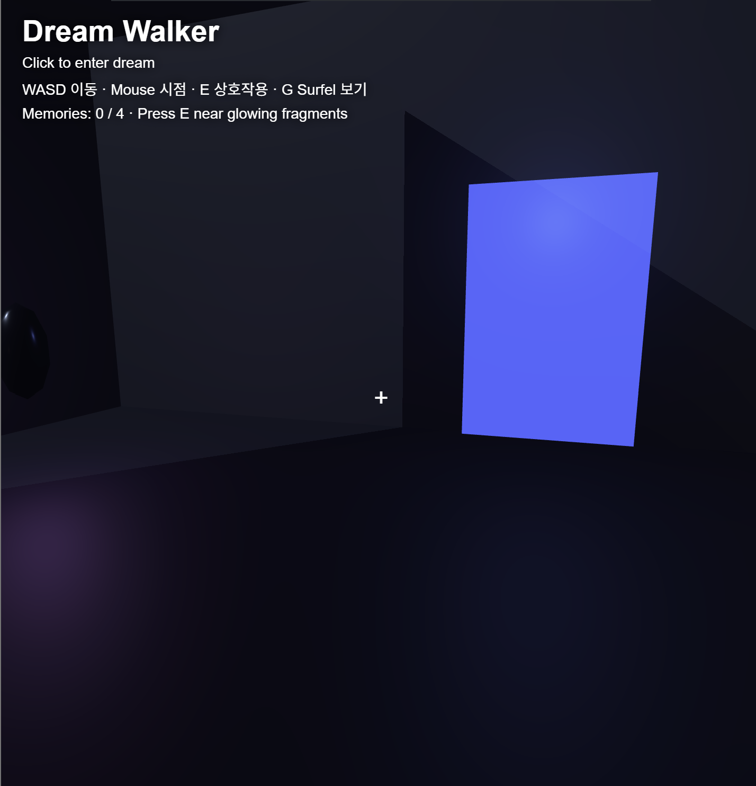

일반 렌더링 상태

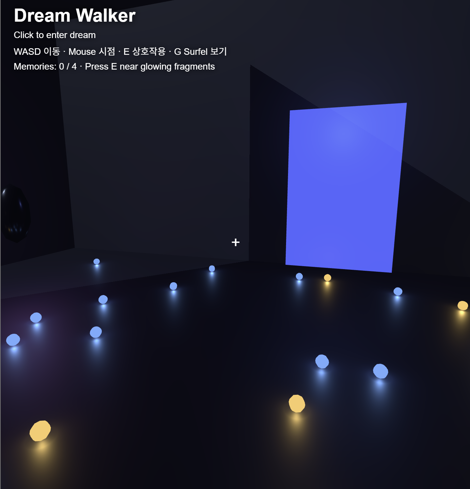

Surfel Visualization 활성화 상태

사용 코드

```javascript
if (event.key.toLowerCase() === 'g') {
 surfelVisible = !surfelVisible;
}
```

G 키를 눌렀을 때 Surfel Visualization이 켜지고 꺼지도록 구현하였다.

강의에서 학습한 Surfel 개념을 게임 안에서 직접 확인할 수 있도록 만들었다.
---

## 4. 구현 과정에서의 시행착오

### 4-1. 엄마 NPC 걷기 애니메이션 문제

엄마 NPC가 플레이어를 추격하도록 만들었을 때, 처음에는 그냥 슬라이딩하는 것처럼 보였다.

내가 추구하는 공포 게임 분위기와 맞지 않는 모습이어서 실제로 걸어오는 느낌을 조금이라도 주고 싶었다. 그래서 엄마 모델의 위치를 사인 함수로 살짝 위아래로 움직이도록 만들었다.

사용 코드

```javascript
momNPC.userData.walkPhase += 0.18;

momNPC.position.y =
  Math.abs(Math.sin(momNPC.userData.walkPhase)) * 0.04;
```

이 코드는 시간이 지날 때마다 `walkPhase` 값을 증가시키고, 그 값을 이용해서 엄마 NPC의 y 위치를 조금씩 바꾸는 방식이다. 실제 다리 애니메이션은 아니지만, 모델이 아주 살짝 위아래로 움직이기 때문에 그냥 미끄러지는 것보다는 걸어오는 느낌이 났다. 

처음에는 더 자연스럽게 보이게 하려고 회전값도 같이 흔들었다.

```javascript
momNPC.rotation.z =
  Math.sin(momNPC.userData.walkPhase) * 0.025;
```

그런데 이 값을 너무 크게 주거나 위치 변화와 같이 사용하니 배꼽을 기준으로 회전하는 엄마 NPC 모델의 머리가 바닥으로 가고 다리가 올라가면서 시계바늘 같이 회전했다. 모델이 실제로 걷는 애니메이션을 가진 것이 아니라, 코드로 위치와 회전만 억지로 흔든 것이기 때문에 엄마가 바닥으로 사라졌다가 다시 생기는 문제가 생겼다. 바닥으로 사라졌다가 나오는 것이 더 무섭다고 여겨지기도 했지만 자연스럽게 걷는 것이 더 꿈과 현실을 구분하기 힘들겠다는 판단하에 수정했다. 

그래서 최종적으로는 회전은 최소한으로만 사용하고, y 위치를 아주 작게 흔드는 방식으로 수정했다. 이는 자연스럽게 몸을 까딱거리는 것처럼 보이게 했다. 이 과정을 통해 3D 모델을 움직일 때는 단순히 위치만 바꾸는 것과 회전까지 함께 바꾸는 것이 결과에 큰 차이를 만든다는 것을 알게 되었다. 

게임에서 걷는 캐릭터를 보고 이상하게 걷는다고 생각했었는데 자연스럽게 걷는다는게 얼마나 힘든 일인지 실감하게 됐다.


---

### 4-2. 꿈에서 깬 뒤에도 붉은 방이 유지되는 문제

처음 구현했을 때는 꿈에서 깨어나서 "침대에서 깼다. 엄마에게 가보자." 가 나왔는데도 뒤에도 붉은 조명과 색상이 그대로 남아 있었다.

그래서 꿈에서 깨어나는 함수에서 Scene 내부의 Material과 Light 값을 원래 상태로 되돌리도록 수정하였다.

이 과정을 통해 현실로 돌아온 느낌을 표현할 수 있었다.


---

### 4-3. 엔딩 연출 문제

마지막에 현실의 엄마인 줄 알았던 존재가 얼굴을 들이미는 장면이 가장 중요한 공포 타이밍이었다. 근데 계속 엄마 엉덩이만 확대되는 문제가 생겼다. 얼굴이 확대되야 무서운데 계속 엉덩이만 확대됐다.

Three.js가 캐릭터를 확대할 때 이것이 엉덩인지, 얼굴인지 구분하지 않는다는 것을 알게 됐다.

이를 해결하기 위해 lookAt을 활용해 엄마 npc가 플레이어의 시점(카메라가 있는 곳)을 향해 확대되도록 설계할 수 있었다. 

이 부분이 공포감을 조성하기에 굉장히 중요한 장면이었는데 공포감을 유지하며 게임을 끝낼 수 있도록 수정했다.


---

### 4-4. 함수 중복 선언 문제

개발 과정에서 interact 함수와 변수들이 중복 선언되어 게임이 실행되지 않는 문제가 발생하였다.

브라우저 콘솔을 통해 오류 위치를 확인한 뒤 중복된 선언을 제거하였다.

이번 프로젝트를 진행하면서 콘솔 오류를 읽는 능력이 생각보다 중요하다는 것을 느꼈다.

---

### 4-5. GitHub Pages 배포 문제

게임을 GitHub Pages로 배포하는 과정에서 정적 파일 경로 문제가 발생하였다.

로컬 환경에서는 정상적으로 실행되었지만 GitHub Pages에서는 JavaScript 파일과 모델 파일을 찾지 못해 게임이 실행되지 않았다.

빌드 결과물(dist) 구조를 확인하고 경로를 수정하여 문제를 해결하였다.

또한 GitHub Pages가 기본적으로 README를 먼저 표시하는 문제도 있었기 때문에 index.html 경로를 수정하여 게임이 정상적으로 실행되도록 변경하였다.

이번 프로젝트를 통해 구현뿐만 아니라 실제 배포 과정도 중요하다는 점을 알 수 있었다.

---

## 5. 느낀 점

이번 프로젝트를 진행하면서 수업 시간에 배운 내용을 단순히 따라 하는 것과 실제 게임에 적용하는 것은 많이 다르다는 것을 느꼈다.

처음에는 단순한 공포 게임을 만들 생각이었지만 구현을 진행하면서 카메라, 조명, 상호작용, 애니메이션, 상태 관리 등 다양한 요소들이 함께 동작해야 한다는 것을 알게 되었다.

특히 작은 버그 하나 때문에 게임 전체가 실행되지 않는 경우도 많았기 때문에 디버깅의 중요성을 많이 느꼈다.

또한 내가 실제로 경험했던 꿈을 게임으로 표현할 수 있어서 재미있었고, 평소에는 무섭게만 느꼈던 기억을 직접 작품으로 만들어 본 점이 가장 인상 깊었다.

평소에 게임할 때 캐릭터 움직임이 이상하다고 많이 놀렸었는데 이게 얼마나 힘든 일인지 깨달았다. 그리고 내가 평소에 많이 하는 공포게임들에 얼마나 많은 노력과 인내가 들어갔는지 느꼈다. 이 프로젝트를 마무리하고 게임을 하면 어떤 원리로 게임이 구성됐는지가 보일거라는 생각이 들어서 기대가 된다. 

강의에서 배운 내용을 실제 프로젝트에 적용해 볼 수 있었던 좋은 경험이었다.

